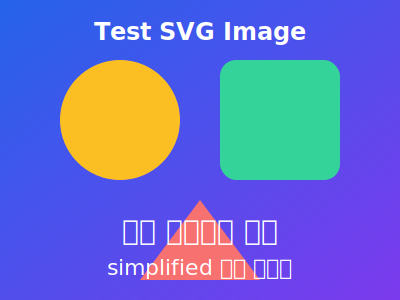

# Test Markdown File

This is a sample **Markdown** document used for testing rendering and parsing.

## Headings

You can use multiple levels of headings.

### Sub-heading

Some _italic_, **bold**, and `inline code` text.

## Lists

Unordered:

- Apples
- Oranges
- Bananas

Ordered:

1. First
2. Second
3. Third

## Code Block

```js
function greet(name) {
  return `Hello, ${name}!`;
}

console.log(greet("world"));
```

## Table

| Name  | Role     | Location |
| ----- | -------- | -------- |
| Alice | Engineer | Calgary  |
| Bob   | Designer | Toronto  |

## Blockquote

> This is a blockquote used to test quoting styles.

## Internationalization & Emoji

- Simplified Chinese: 测试文件，简体中文
- Traditional Chinese: 測試文件，繁體中文，歡迎使用
- Japanese: 日本語のテスト
- Emoji: 🎉 🚀 🐉 🧧 ✅ ❤️ 🌏 👍 😀 🔥 🎊 🀄

> 引用測試：「繁體中文」與 emoji 🐉🎊 一起顯示。

## Link & Image

[Example link](https://example.com)



---

_Generated for testing purposes._
